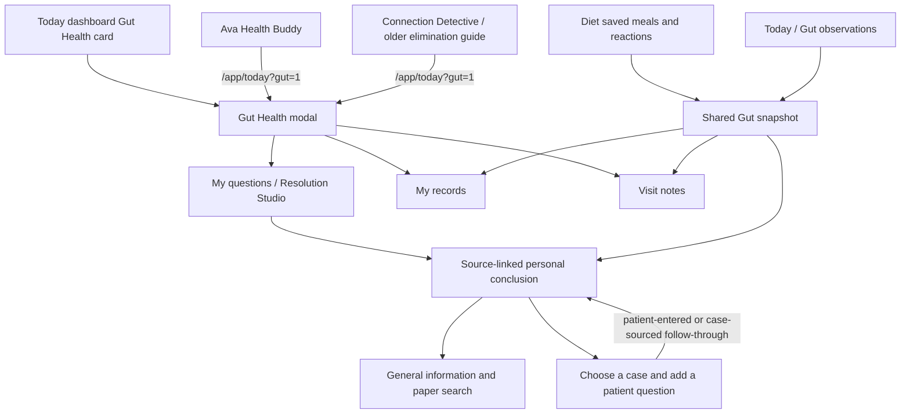

# Gut Health completion packet

**Prepared:** 26 September 2026
**Branch:** `master`
**Starting application revision:** `1660b1bbe1d3d2a535a36a666b840a381196e4a4`
**Purpose:** a handoff that records the live route/data model, work completed in this pass, market research, verification, and release gates. This is an implementation record, not clinical approval.

## Current route map

`CaseDashboard.tsx` opens the modal from `?gut=1`; the current shell is `GutHealthModal.tsx`. Existing questions resume without repeating intake. Diet and canonical observation stores remain the sources of personal records. Case Prep is an explicit user-selected handoff. Ava and older Connection Detective paths lead to the same workspace. The old trial/challenge area remains separate and is not opened by a Gut conclusion.

## Source and count ledger

| Displayed information | Source and scope | Missing/conflict rule | Consumers |
| --- | --- | --- | --- |
| Meal records | `getGutSnapshot()` plus profile-scoped active canonical observations, merged by source identity in `mergeGutSnapshotWithObservations()` | Linked meal observations are not counted twice. Undated meal observations remain inspectable and are excluded from dated comparison. | Gut workspace, My records, visit notes, copy brief |
| Digestion dates and ratings | Existing daily Gut records plus canonical symptom/bowel/check-in observations | A missing date or field is unknown, never symptom-free. Same-date ratings are context, not a meal-linked outcome. | My records, backtrace/context, copy brief |
| With / without / unresolved counts | `deriveGutEvidence()` over exact selected meal name, matching profile/date, explicit symptom-specific observation or supported Diet reaction | Conflicting linked reports stay unresolved; broad “no reaction” and absent outcome remain unknown. A name does not establish recipe/ingredients. | Conclusion, source drawer, evidence view, brief |
| Date and timing | Source `occurredAt`, `localDate`, timezone and `timePrecision`; question time only anchors browsing when onset was not entered | Date-only records do not gain an invented time. Delayed reporting remains separate from occurrence time. | Conclusion, backtrace, source detail, brief |
| Research citations | Generic symptom/topic query to Europe PMC; neither exact private question nor meal name is sent | Search is discovery, not synthesis. Publication index metadata is not a quality grade; no result is not evidence of no research. | Optional Research view, copied citation list |
| Visit outcome | A specific existing case question with Gut thread source reference and Case Prep provenance | Patient recollection remains labeled as the patient's report; verified clinician-record outcomes keep their provenance. | Gut follow-through, Case Prep |

## Competitor and clinical-source review

Research checked 26 September 2026. This comparison describes vendor-published features; it is not an independent efficacy assessment.

| Product/source | Publicly documented approach | Product lesson for HealthChain |
| --- | --- | --- |
| [Monash FODMAP app help](https://www.monashfodmap.com/get-app-help/) | Lab-tested food guide, traffic-light serving information, recipes, a diary for food/symptoms/bowel habits/stress, staged reintroduction, diary export, and local-device diary storage. | Tracking, graphs, food lists, and exports alone are not a distinct paid proposition. Keep new challenge programs clinically governed; make the user's actual question and source trail the central object. |
| [mySymptoms iOS guide](https://www.mysymptoms.net/ios-user-guide/) | Configurable 1–72 hour analysis window, suspect score/ratio, trend charts, and an explicit warning that correlation does not establish cause. | Do not add a more polished-looking score that still implies personal causation. Make missingness, counterexamples, exact source IDs, and what cannot be concluded visible before optional detail. |
| [Cara Care IBS](https://cara.care/en/reizdarm) | A structured program combines tracking, questionnaires, personalized modules, recipes, nutrition content, and behavioral / mind-body tools. The vendor says the referenced IBS therapy is currently available in German. | A broad program has more content than this feature should imitate. Keep onboarding short and question-led; build value around a concrete user decision or care conversation. Do not claim clinical benefit by analogy. |
| [NIDDK IBS diagnosis](https://www.niddk.nih.gov/health-information/digestive-diseases/irritable-bowel-syndrome/diagnosis) | Diagnosis uses a clinician's symptom and medical/family history plus exam; other signs may lead to evaluation for other conditions. | Gut Health must not diagnose or triage from a diary. Keep the general care message pending an independent clinician review. |
| [AGA diet guidance for IBS](https://gastro.org/clinical-guidance/the-role-of-diet-in-irritable-bowel-syndrome-ibs/) | Recommends dietitian support for appropriate patients, predetermined time limits for diet interventions, and low-FODMAP restriction followed by reintroduction and personalization. | Keep the current challenge gate closed. Correlation and article discovery must not initiate restriction, medication changes, or food challenges. |
| [WCAG 2.2](https://www.w3.org/TR/WCAG/) | Requires accessible interaction and alternatives to color-only meaning. | Keep evidence labels in text, source buttons keyboard-operable, reduced-motion support, and mobile layouts as stacked cards. |

## Research gate now in code

`GutResearchService.ts` searches only controlled generic symptom/topic terms. It deduplicates PMIDs, filters retracted records, prioritizes review publication types for reading, checks exact saved PMID status, and caches generic query results in memory for 15 minutes. The cache is not account-scoped and stores no question, meal, profile, or health record.

The new `GutReviewedEvidence.ts` defines the publication contract for a user-facing finding: exact source and locator, short supporting passage, population, exposure, comparator, outcome, setting, limitations, independent reviewer qualification, and review date/version. Its registry is intentionally empty. `GutReviewedEvidencePanel` clearly says no independent synthesis is available and keeps raw paper discovery labeled as such. Search results are never automatically promoted into a health claim.

## Clinical, user-research, and rollout packet

These are actual release gates, not work a code change can sign off:

1. **Clinical review:** a GI clinician and/or registered dietitian must review the current-concern wording, source registry contract, research/applicability copy, care handoff, and trial boundary. Record reviewer, qualification, exact approved text/claim, source passage, limitations, date, and content version. No reviewer has been represented as having approved this build.
2. **Comprehension study:** moderate first-use tasks with people with diagnosed gut conditions and people with undiagnosed concerns. Include zero-data, mixed, conflicting, and care-question scenarios. Ask participants to explain (a) what their own records show, (b) what remains unknown, (c) what research says versus does not say, and (d) what they would do next. Predeclare the original plan thresholds: at least 80% correctly explain conclusion/next action; at least 80% distinguish personal records from research; median first-use path under 3 minutes; no rise in food restriction or worry; direct willingness-to-pay validation. Document failures and revisions. No participant study has been run here.
3. **Authenticated sync/RLS:** migration contract and anonymous Supabase smoke can establish schema presence and anonymous denial only. Still test two authorized accounts on separate devices, offline edit queue, conflict resolution, profile switch, guest promotion, revision, and deletion with test accounts in staging. No production patient data should be used.
4. **Controlled rollout:** this repository has a quality workflow on pushes to `master`, but no Gut-specific runtime feature flag or verified deployment URL/SHA was found during this pass. Confirm CI and deployment independently, document rollback/incident owner, and add a flag before any staged exposure if the deployment platform requires it. A Git push alone is not proof that production deployed.

## Deliberate product boundaries

- The initial path remains two small steps: choose one of the four Clinical-style icon cards, then write one editable question. Optional fields and existing-data inspection stay optional; no mandatory diary or extra confirmation screen is added.
- Richer comparison/context stays behind relevant evidence and disclosures. No sprawling graph or automatic causality score is introduced.
- No fabricated meals, symptoms, users, source summaries, clinical endorsements, research findings, or progress figures ship.
- The current visual direction preserves the Clinical palette, vivid textured icons, and standard dashboard card. The first-use and mobile browser checks are the regression guard; clinician/design owner review remains open.

## Verification evidence

Run logs and exact final counts are recorded in `GUT_HEALTH_CONCLUSION_IMPLEMENTATION_STATUS.md` after the final validation pass. The migration contract has passed; the anonymous Supabase smoke found the `health_observations` relation and expected anonymous denial. Authenticated two-device validation, production deployment SHA, independent clinical review, and measured user value remain unverified.
