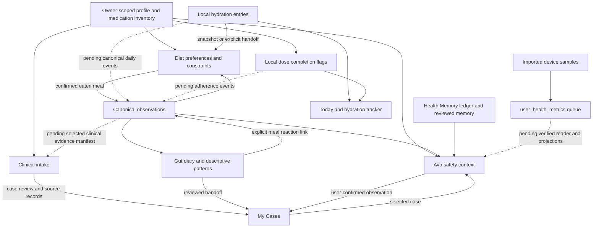

# Cross-feature pillar audit

Audit date: 1 October 2026. Baseline: `e98083238ab932e9da96ae6d009c35c77dbf3b70`.
Scope: Health Memory, Ava, Clinical Review, hydration, medications, Gut Health, Diet Plan, My Cases, their subfeatures, API boundaries, local persistence, cloud ownership and notifications.

## Verdict

**These pillars are partly connected; the app does not yet have one complete, consistent health-data pipeline.** Profile sharing and several explicit case/meal handoffs exist. Sharing a profile is insufficient to share actual water intake, doses taken, device measurements or the provenance of every interpretation. Those gaps affect the answers a person can reasonably expect from Ava and clinical review.

This pass fixes confirmed persistence, ownership and measurement defects. It does not certify every clinical answer, nutrition estimate, physical-device integration or notification delivery. Pending tickets below are implementation work, not completed features. Existing Diet and Ava release reports remain useful for their narrower scopes; passing those releases did not establish all of the connections reviewed here.

The investigation used source tracing, regression tests, schema/policy metadata, anonymous API checks and synthetic records rolled back after testing. It did not inspect private patient records or send messages to users.

## Actual data architecture

Solid edges are existing code paths; dashed edges are missing or incomplete. Arrows do not imply medical causation. The profile, observation ledger, case repository, memory ledger and local trackers have different responsibilities. Health Memory is not the only database and an AI summary in it is not automatically a reviewed clinical fact.

## Pillar and subfeature inventory

| Pillar | Existing features and connections | Material gap / expected user behavior |
|---|---|---|
| **Health Memory** | Profile/timeline summaries, reviews, lab/diet events, proposed memories, review/edit/delete, owner-scoped local persistence, cloud ledger, tombstones, archive support. Ava can consume reviewed memory and a bounded context snapshot. | One meal can appear both as a canonical observation and a memory summary. Count by originating record, not by number of representations. Preserve original source, review state and corrections; a derived summary must not silently become a diagnosis. |
| **Ava** | General and selected-case conversations; transcript recovery; immutable reply context; profile safety context; case records; canonical meal/day/Gut context; explicit Diet handoff; interactive cards, disclosures, breathing guide, activity catalog, day check-in and confirmed case save. | Water and dose histories are not consistently available as a shared daily stream. Imported device measurements have no verified Ava reader. Replies need source freshness and clear missing-data explanations. General/case separation must continue to hold as more streams are added. |
| **Clinical Review** | Intake, document extraction, evidence classification/quarantine, case-bound reviews, source-grounded narratives, versioned case events, My Cases and case preparation. | There is no complete, reviewed manifest of selected daily observations, medication adherence and hydration. QuickConsult can promote AI-extracted lab values into the profile before human verification. A printed range must remain distinguishable from an inferred interpretation. |
| **Hydration** | Today quick add, tracker/modal, millilitre totals, undo/remove, target, local habits, native reminder scheduling; Diet uses a shared local total and explicit Ava handoff. | Authoritative drink entries and settings are local, not canonical cloud events. Timestamps are display strings plus a day, not full instants with timezone/precision. Diet's rounded 250 ml glass representation loses precision for other amounts. New-device continuity and export are incomplete. |
| **Medications** | Medical Profile and Daily Meds & Vitamins share normalized inventory; enabled schedule, time editing, today's completion flags, Today banner/habits, native reminders, narrow supported label guidance. Inventory is in profile sync. | A schedule is not a record of ingestion. Today's taken flags are device-local and cannot represent each occurrence of a multi-dose regimen, late/skipped/unknown doses, an actual time or a reason. Reminder success and adherence must remain separate. |
| **Gut Health** | Shared meal observations, symptoms, bowel/context logs, day answers, timing-aware reasoning, descriptive patterns, questions, source appraisal, research threads, reviewed case handoff and deliberate personal-observation/research boundaries. | Cloud previously dropped explicit references, breaking reactions and case filtering. Fixed for newly synced records. Legacy Today check-ins and canonical day records still need one identity. Missing historical references require reviewed repair rather than inferred links. |
| **Diet Plan** | Location/country/cuisine onboarding, preferences and constraints, typed seven-day generation, lifecycle/replay validation, portions and swaps, meal confirmation, shared food diary, Clinical Lens food/label capture, Snap Gallery, packaged-food nutrition basis, product lookup, grocery/pantry workflows, saved meals, digestion calendar, reaction timeline, insights/patterns, Guardrails, Bio-Stack suggestions and Ava handoff. | A generated meal is not consumed until confirmed. Nutrition estimates are not verified label/catalog measurements. Profile restrictions changing after plan generation need freshness handling. Hydration and duplicate profile representations need consistent projections. Location alone must not override allergy, dietary or affordability constraints. Guardrails and supplement suggestions need provenance and review; they are not a comprehensive interaction checker or a prescribing feature. |
| **My Cases** | Owner-scoped drafts, records, reviews, questions, event history, outcomes, appointments, preparation/export, clinical review destination, Ava case selection, reviewed Gut handoff, cloud merge and deletion tombstones. | Daily observations should become case evidence only through an explicit selection/review. Deleted or edited case sources need stale-source handling in retained replies, research threads and attachments. An active-case fallback must not silently attach General data to the wrong case. A generated case summary/export must retain source review status. |

### API and infrastructure inventory

| Boundary | What exists | What has not been established |
|---|---|---|
| AI gateway | Operation allowlist, quota/request accounting and bounded typed contracts for important Ava/Diet/Gut flows. Common client requests now capture account scope and reject stale responses. | Several legacy operations still depend on browser-authored prompts and looser JSON handling. Every operation needs a server-owned schema, structured failure, timeout/retry/recovery policy and cost accounting. |
| Food product / nutrition | Packaged-food lookup and nutrition provenance distinguish label basis, portion conversion and estimates. Meal diary is shared with Gut. | Visual/text estimates cannot guarantee the actual recipe, cooked weight or brand composition. Verified per-100 g/per-100 ml data and measured consumed portions need explicit provenance. Missing weight/basis must not be converted to a confident total. |
| Clinical research / trials | Separate retrieval and reviewed research workflows; explicit study/case handoffs. | Metadata, an abstract and a registry listing are different evidence classes. None establishes a personal causal relationship or a treatment outcome. Refresh/retraction/source-version handling needs shared rules. |
| Device health data | Native Health plugin permission/read path; owned queued `user_health_metrics` rows. This pass corrects aggregation and sync reporting. | No application consumer of those rows was found. Physical permissions, pagination, overlapping device sources and background ingestion are not verified by browser tests. Imported data is not yet a complete personalization feature. |
| Notifications | Native local water, medication, check-in and meal reminders; permission/channel helpers; push device registration and receive/action listeners. | No server push sender was found in this repository, and Supabase `list_edge_functions` returned an empty list for `cikikocfvfshloqwnyfe`. External infrastructure has not been certified. Push action routing, owner-bound reminder preferences, delivery and duplicate prevention need verification on real devices. A successful registration/test call is not proof of ongoing delivery. |
| Cloud / offline | Owner RLS, durable outbox, case merges, memory deletion handling and canonical observation storage. Root sign-in and online recovery now hydrate observations. | This is not complete realtime synchronization of all stores. Whole-profile reconciliation still needs per-field conflict/deletion semantics. Outbox acceptance must be distinguished from server acknowledgement. |
| Archive / logout | Settings archive covers selected profile/case/Diet keys and durable memory, messages and observations. Logout now preserves owner-scoped durable records even without an outbox copy. | Daily `healthchain_hydration_*`, `healthchain_vitamins_*` and habit keys are outside the current Settings export prefix contract. Guest migration and explicit device erasure need complete reviewed workflows. Logout retention does not mean backups or encryption are complete. |

## Confirmed defects fixed in this pass

| Ticket | Defect and change | Evidence |
|---|---|---|
| CF-01 | Cloud writes/reads omitted explicit meal/case references. Added `record_references`, validated same-owner/profile links, round-trip parsing and conflict detection. | Observation regression tests; live authenticated two-owner SQL test, including foreign reference rejection and another owner's inability to read/update; rolled back synthetic rows. |
| CF-02 | Delayed profile saves/downloads could cross accounts; undo history could cross owners; newer explicit empty arrays were treated as missing. Added owner/epoch/key guards, history isolation, authoritative empty arrays and guards against same-account concurrent local edits. | Ten shared-profile regressions, including delayed auth/download, A → logout → A, old save finishing after a newer one, undo and empty corrections. |
| CF-03 | Logout deleted local cases/observations/messages even when no outbox copy existed; native clear could race with restoration. Retain scoped durable keys, remove transient keys individually and stop stale cleanup after an account transition. | Storage regression tests and real-root browser logout journey. Explicit account deletion remains a separate workflow. |
| CF-04 | Common AI calls could use the next account's token for an earlier account's payload; explicit guests could send stale signed JWTs; non-Ava 429 errors could trigger an upgrade. Scope-guard all operations; distinguish throttling (429) from entitlement/quota (402). | Delayed authentication/provider and explicit guest tests; 429 regression; delayed quick-nutrition browser journey. |
| CF-05 | Lab extraction appended local functional-range alerts not printed on the report; demographic prompt invited range inference. Removed that injected interpretation and preserve printed ranges and zero-valued demographics. | Lab extraction regression. This does not certify OCR/model accuracy or replace review of the original report. |
| CF-06 | Opening Ava first on a new device could omit cloud daily records because hydration happened only inside Diet/Gut. Bootstrap canonical observations from the root and recover failed queues on online flush. | Root flow tracing plus observation/service tests. Full signed-in two-device acceptance remains CF-23. |
| CF-07 | Device ingestion summed heart rates, dropped valid zero activity, ignored queue failures and reported success. Store `heartRate_average` in bpm, preserve activity zero, retain sleep state/unit, enforce owner scope and report queued/partial/no-data. Removed fake native heart-rate/HRV values from the dormant ambient stub. | Device tests for average/zero/unit handling, account change, failed queue, guest access and stub behavior. Physical device delivery remains unverified. |
| CF-08 | UTC-or-local check-in matching could remove yesterday after local midnight; an unsupported memory kind could lose the summary. Use explicit local day and supported `profile_event` kind. | Local-midnight, yesterday preservation, zero score and memory-kind regression. |
| CF-09 | Health Memory screen did not refresh on profile/logout; delayed QuickConsult and Quick Nutrition replies could continue after account change. Refresh relevant surfaces and guard post-read/post-analysis commits. | Source tracing, scope/API regressions and delayed nutrition browser journey. Other legacy clinical consumers still need CF-15. |
| CF-17 safeguard | Guest sign-in could overwrite a returning account's saved local records and remove a failed copy. Existing destinations now win; remove source only after verified copy, and exclude transient keys from the generic migration. | Source review. This is a safeguard, not a complete guest reconciliation/import workflow. |

The additive migration is `supabase/migrations/20261001060004_cross_feature_observation_links.sql`. It was applied to the connected production Supabase project before the application release. Existing rows default to an empty reference array. That preserves compatibility, but does not recreate links the old cloud writer already lost. Targets are resolved by consumers inside owned records; references do not provide a general foreign-key/existence guarantee and can arrive before their offline target.

## Rules for useful, truthful correlations

1. **Identity:** use owner, profile, case when applicable, canonical source ID and source revision. A profile snapshot, memory summary and diary card derived from one meal are one underlying record.
2. **Time:** retain actual event time, timezone and precision. A date-only meal or a missing dose time cannot establish an exact delay before symptoms. Travel and local midnight must not silently change recorded days.
3. **Answers:** preserve yes, no, unknown and unanswered. No logged symptoms is not a recorded symptom-free day; no taken flag is not proof of a missed dose.
4. **Associations:** start with descriptive sequences, explicit user associations, denominators, counterexamples and missingness. Consider preparation, portions, other meals, medicines, sleep and stress before suggesting a question to explore.
5. **Interpretations:** label AI hypotheses and retain their source manifest. Repeating a hypothesis in Ava, memory and a case must not promote it to verified evidence.
6. **Clinical evidence:** identify the original report, printed unit/range, clinician attestation and review status. Medication/supplement changes and disease findings require appropriate evidence and clinical review.

The immediate design opportunity is a shared **“What changed?”** view: corrected profile fact, changed plan constraint, newly logged intake, actual dose report and relevant case update, each with source/freshness and missing-data explanations. This should reduce repeated intake across eight features. It requires the record contracts below before introducing more confident pattern cards.

## Implementation tickets remaining

P1 means required for trustworthy cross-feature behavior. P2 is supporting architecture/operational work. “Pending” means the feature or its acceptance evidence is absent; none of these tickets is implicitly completed by this audit.

| ID / priority | Work and concrete acceptance | Dependencies |
|---|---|---|
| CF-10 / P1 | **Canonical hydration.** Add owner-scoped intake events in ml, full event time/timezone/precision, source and correction/deletion history. Migrate existing dated logs without inventing instants. Today, Diet and Ava must project the same total; 300 ml must remain 300 ml after reload/new-device sync, undo and travel. | CF-01, CF-03; additive schema and reviewed legacy migration. |
| CF-11 / P1 | **Medication occurrences/adherence.** Model inventory separately from each scheduled occurrence and reported taken/skipped/unknown event. Preserve actual time, dose text, reason and correction. Test multi-dose regimens, discontinuation, travel, offline duplicate taps, native reminders and two-device reconciliation. Ava must never treat a reminder or missing flag as ingestion. | CF-10 event conventions; medication reconciliation and CF-21. |
| CF-12 / P1 | **Selected clinical evidence.** Add a reviewed observation picker and immutable request manifest of source IDs/revisions/units/precision/admissibility. A daily entry must not silently attach to the active case. Changed or rejected sources invalidate downstream interpretations. Verify each response against its actual case snapshot. | CF-10, CF-11, CF-14, CF-19. |
| CF-13 / P1 | **Profile reconciliation.** Replace competing whole-profile row assumptions with a versioned authoritative contract, per-field conflict rules and deletion semantics. Offline A edits allergies while B edits weight: both survive; a removed medication never resurrects from a legacy schedule/row. Keep server-owned entitlements separate from user-imported health fields. | Migration design and signed two-device tests. Current async guards do not solve distributed conflicts. |
| CF-14 / P1 | **Freshness and deletion propagation.** Fingerprint the profile constraints/source revisions used by plans, pattern cards, replies and case reviews. Changing an allergy must clearly stale an incompatible plan. Editing/deleting a linked record must not retain an unexplained current claim or resurrect the record. Retained historical replies keep their original snapshot and show changed-source status. | CF-13, CF-19; case tombstones. |
| CF-15 / P1 | **Every API operation contract.** Inventory all gateway operations and move remaining prompt authority/validation to server-owned schemas. Fail visibly on blank/truncated/malformed output, stale case/account and unusable OCR. Define retry/replay/abort/refund semantics for each paid operation. Add adversarial output and post-JSON consumer race tests. | Operation inventory; existing typed Ava/Diet/Gut contracts. |
| CF-16 / P1 | **Complete health archive.** Include scoped hydration, adherence and habits plus canonical histories and required tombstones. Validate owner, structure, provenance and unsupported fields; preview import, handle conflicts and roll back partial failure. Export → restore must reproduce each pillar's daily record on a clean device without restoring auth or entitlement claims. | CF-10, CF-11, CF-13, CF-17. |
| CF-17 / P1 | **Guest/account reconciliation.** Review an import before merging guest data into an existing account. Rewrite owner-bound record/reference identities consistently; migrate IndexedDB, localStorage and native preferences together. Keep conflicting destinations and failed source records recoverable. Test guest meals, case links, memory, water and doses with a returning account. | CF-13, CF-16. Blind overwrite safeguard is done; complete import is pending. |
| CF-18 / P1 | **Historical reference repair.** Identify owned local records that still have references absent from their cloud version. Offer a reviewed repair; never infer a meal/case link solely from timing or text. Conflict resolution must create a revision and an audit receipt. | CF-01 and conflict UI. Unrecoverable links must remain unknown. |
| CF-19 / P1 | **Source identity and provenance graph.** Carry source ID/revision, original-vs-derived role and review state into memories, summaries, patterns and clinical manifests. Count an event once across projections. A synthetic AI hypothesis copied between all pillars must still be marked derived, never clinician-confirmed. | Event contracts and reviewed memory workflow. |
| CF-20 / P1 | **Device data consumer.** Implement paginated reads, source deduplication, ownership and provenance, sleep-stage handling and explicit aggregate semantics. Add a verified read projection for Ava/clinical consumers. Historical summed-heart-rate rows must not masquerade as mean/resting HR. Compare a known physical-device fixture with source-app values and document unsupported measurements. | CF-07, CF-19, physical hardware. |
| CF-21 / P1 | **Notification lifecycle.** Scope preferences/actions to owner, reconcile cancellation on logout/schedule change, show permission/scheduling failure, and define web vs native behavior. If remote push is required, add an authenticated sender and bounded action routing with delivery/duplicate evidence. Verify foreground/background/terminated app, denied permission, timezone change and a prior owner's notification tap. | CF-11, actual native builds and sender deployment if needed. |
| CF-22 / P1 | **Accuracy evaluation.** Curate source-labelled report, nutrition, country/cuisine, allergy and clinical context fixtures. Distinguish verified label/catalog numbers from estimates, preserve per-100 g/ml basis and measured portions. Clinician/dietitian review must evaluate unsupported inferences, missingness and multilingual answers. Unit tests alone cannot establish medical truth or user satisfaction. | Verified datasets, CF-12, CF-15; qualified review. |
| CF-23 / P1 | **Real user journeys.** Run two signed-in devices, offline recovery, token expiry, account switching, native file/photo/audio/permissions and accessibility. Cover corrections flowing between all pillars, data deletion and archive restore. Conduct task-based usability sessions: log once, correct once, prepare a visit, explain a pattern and recover a failure. Record observed failures and close them before a completion claim. | CF-10 through CF-22; representative devices/users. |
| CF-24 / P2 | **Pillar contract registry.** Expand the feature architecture contract to explicitly include Memory, hydration and medications, their routes, store owners, API operations, read/write projections and handoffs. Update older architecture claims against actual code; gate contract drift, not screenshots alone. | Confirmed map above; no new clinical capability implied. |
| CF-25 / P2 | **Database hardening/performance.** Review existing mutable-search-path functions, authenticated definer grants, leaked-password setting, duplicate policies and missing FK indexes against actual privileges/query plans. Server-only ledgers intentionally have RLS and no browser policy; do not open them merely to silence an advisor. | Query-plan/security review; separate scoped migrations. |

### Delivery sequence

1. Release the confirmed CF-01 through CF-09 fixes and the CF-17 safeguard with database and browser verification. Preserve one existing Git branch and identify the exact production SHA.
2. Define daily-event/source contracts; implement CF-10/CF-11/CF-19 together, with migration previews and exports. Keep existing user data recoverable throughout.
3. Complete distributed reconciliation, source freshness, archive and guest import (CF-13/14/16/17/18). Exercise the same account on two devices before broadening evidence consumption.
4. Connect selected clinical evidence, real device readers and complete API/notification lifecycles (CF-12/15/20/21). Add immersive cards only for actions the app can actually execute and acknowledge.
5. Run qualified accuracy evaluation and real device/user acceptance (CF-22/23), then close remaining registry/hardening tickets (CF-24/25). Declare completion per accepted ticket and device/platform, not as “everything is perfect.”

## Verification and practical limits

- Final full unit suite: **697 passed, 1 skipped** in **103 files** (102 passed, one skipped). The skipped live Gut model test requires its configured live endpoint; it is not counted as a pass.
- Shared-profile and API integrity tests: **20 passed**.
- Targeted Chromium/WebKit journeys: **42 unchanged journeys passed**; the two added journeys each passed on both browsers after the medication migration marker retention fix (**4/4 regression runs**). The initial two logout failures were corrected and are not counted as passes from that first run.
- Production build and lint passed; migration contract passed **32 migrations / 27 schema checks**. Final release verification is recorded separately below as it completes.
- Production SQL verifier completed successfully; anonymous smoke checks returned no exposed rows and server-only relations rejected anonymous access as expected.
- Live reference migration: tested owned round trip, invalid/incomplete containers, foreign reference rejection and second-owner isolation using authenticated synthetic owners; transaction rolled back, with zero test owners/observations remaining.
- Supabase advisors still report existing project-wide items: security warnings for two mutable-search-path functions, the public vector extension, five authenticated definer grants and disabled leaked-password protection; performance reports include missing FK indexes, RLS initialization plans and duplicate permissive policies. The new invoker validator was not reported in those groups. These are CF-25 work, not evidence of a new cross-owner leak.
- Browser tests use synthetic local records and mocked provider replies. They do not certify real provider consistency, closed-app mobile reminders, sensor permissions or signed-in multi-device convergence.
- Clinical reasoning and food composition remain subject to source quality, measured portions and appropriate review. Zero defects and universal satisfaction are not conclusions supported by this evidence.

### Source anchors

- Ownership/profile/logout: `src/App.tsx`, `AccountScope.ts`, `ProfileEngine.js`, `DurableHealthStorage.ts`, `RunContext.ts`.
- Canonical observations/meal linkage: `HealthObservationService.ts`, `src/domain/observations/types.ts`, `MealCommandService.ts`, `DietMealReactionService.ts`, `dietPatternRecords.ts`.
- Memory/conversations/archives: `HealthMemory.ts`, `AvaConversationRepository.ts`, `HealthArchive.ts`, `src/features/experience/HealthMemory.tsx`, `src/features/profile/Settings.tsx`.
- Daily trackers: `HydrationService.ts`, `VitaminScheduleService.ts`, `MedicationScheduleModel.ts`, `profileScope.ts`.
- Gut/cases/clinical: `GutHealthSummary.ts`, `GutReasoningService.ts`, `GutCaseHandoffService.ts`, `GutReviewedEvidence.ts`, `CaseEngine.ts`, `CaseMergeEngine.ts`, `src/features/consultation/QuickConsult.tsx`.
- APIs/devices/notifications: `geminiService.ts`, `api/gemini.js`, `api/food-product.js`, `HealthTrackingService.ts`, `AmbientSyncEngine.ts`, `PushService.ts`, `NotificationDeviceService.ts`, `DailyCheckinNotificationService.ts`, `DietMealReminderService.ts`.
- Database: additive migration above, `supabase/verify_production.sql`, `supabase/tests/cross-feature-links-rollback.sql`.

Service paths without a directory prefix above are under `src/services`. Database reference: [Supabase RLS documentation](https://supabase.com/docs/guides/database/postgres/row-level-security). Product change review: [Supabase changelog](https://supabase.com/changelog).
